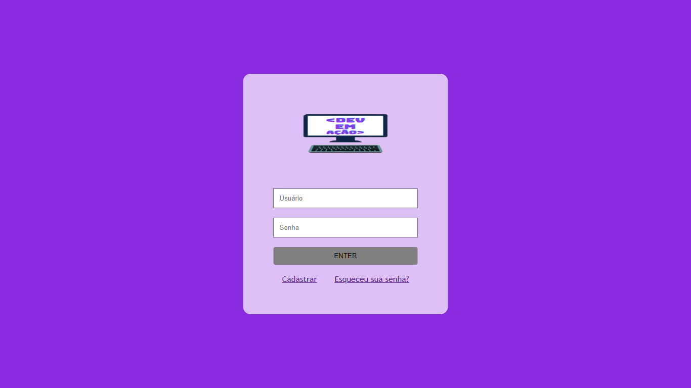

# LoginScreen_With_HTML-CSS
<h3>Neste projeto será implementada uma tela de login, feita em HTML e CSS.<h3>

<h1>🖥 Sobre o projeto<h1>
<h3>O projeto tem a finalidade de criar uma tela de login simples e prática, explorando alguns efeitos que se pode criar com css.<h3>
<h1>✅ LoginScreen pronta!<h1>

<h1>🛠 Ferramentas Utilizadas<h1>
  

<h1>👷 Como rodar<h1>
<h3><li>Clonar o repositório.

git clone https://github.com/pedroAlmeidaDev/LoginScreen_With_HTML-CSS.git

<li>Entrar no editor de código VisualStudioCode.

<li>Executar o arquivo HTML.

<li>Feito isso, abra o seu navegador e acesse http://localhost:5500/ ou em uma porta de sua preferência.<h3>